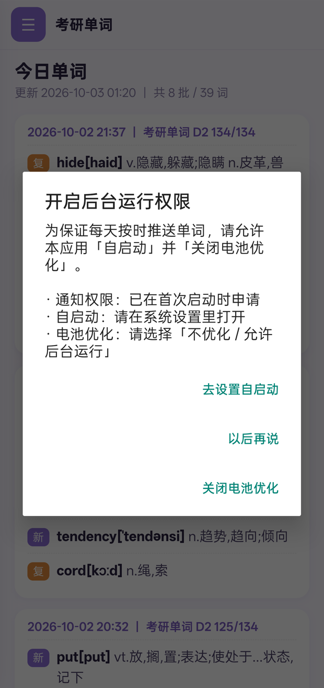
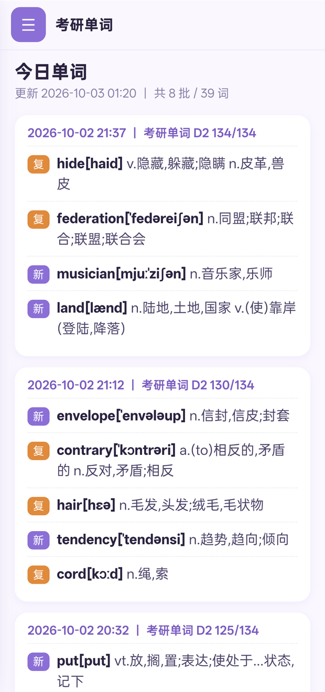
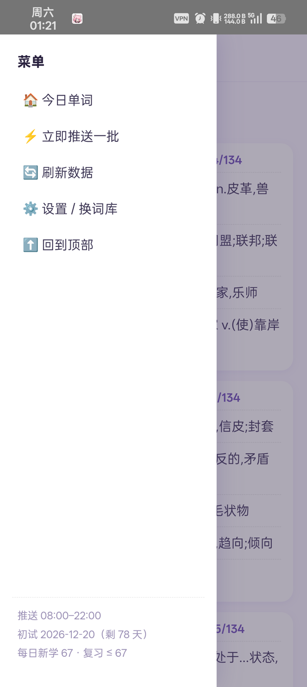

# 考研英语单词小组件 (kaoyan-widget)

一个运行在 Android 上的 **考研英语单词定时推送** 桌面小组件 + App。
每天按计划推送一组单词（桌面小组件 + 通知），并根据距离初试的天数自动倒推每日新学词量。

> ⚠️ **本项目由 AI 生成**
> 本仓库的源码、构建脚本与文档均由 **AI（大语言模型）** 生成，经人工测试与调试后开源。
> 仅供学习交流使用，请自行评估（尤其是定时/通知/权限相关行为）后再安装使用。

---

## 📦 下载

最新版本见 [Releases](https://github.com/shing299/kaoyan-widget/releases)：

- **v1.1.1**：[kaoyan-widget-v1.1.1.apk](https://github.com/Shing299/kaoyan-widget/releases/download/v1.1.1/kaoyan-widget-v1.1.1.apk)

> **v1.3 已在源码中（`versionName 1.3` / `versionCode 5`），尚未发布 Release。**
> 需要尝鲜可自行克隆后按下方「构建」小节编译。

```bash
# 安装 / 覆盖升级
pm install -r -d kaoyan-widget-v1.1.1.apk
```

## 📸 截图

| 权限引导（首次启动） | 主界面 · 今日单词 | 菜单 |
| :---: | :---: | :---: |
|  |  |  |

> 截图为实机运行效果（OnePlus / ColorOS）。首次启动会申请通知权限，并弹窗引导开启自启动、关闭电池优化。

## ✨ 功能特性

- **首次启动设置向导**：第一次打开时引导设置初试日期，未设置前不会推送到通知。
- **初试日期可配置**：默认 `2027-12-20`，可在 App 内随时修改。
- **按剩余天数自动倒推每日词量**：
  - `dailyNew = ceil((词库总数 - 已学)/剩余天数)`，并夹在 `1 ~ 300` 之间；
  - 复习上限 `reviewCap = max(40, dailyNew)`。
- **词库可替换**：内置考研词表（5398 词），支持导入自定义 `txt`（`#` 注释、多分隔符），也支持一键恢复内置词库。
- **定时推送**：通过 `AlarmManager` 定时触发，桌面小组件刷新 + 通知栏推送。
- **推送时段可自定义**：在「设置」里可设置每天的推送起止时间（默认 `08:00–22:00`），单词会在该时段内分批随机推送。
- **一次推送、两种呈现（v1.3）**：闹钟到点推送一批单词时，**同一批词既进通知、也按同样顺序以弹幕划过**
  （批次比日常频率略快，最多 2.5 秒一个）；其余时间按设定频率随机弹。
- **单服务单通知（v1.3）**：推送调度与学习弹幕合并进同一个前台服务 `BotService`，
  通知栏只保留**一条**常驻通知（原来「推送运行中」+「学习弹幕已开启」两条）。
- **学习弹幕（悬浮窗，v1.2）**：使用手机时，从屏幕**右侧向左**划过一条「单词 + 释义」。
  **全天生效，不受推送时段限制**（推送时段只管通知批次）。
  - 弹出频率按 **个/秒** 自定义，**亮屏 / 熄屏独立**（熄屏默认 `0` = 不弹）；
  - 样式可调：字体（默认 / 衬线 / 等宽）、字号、颜色、加粗；
  - **多条弹幕同时存在**（最多 12 条），每条独占一条纵向「泳道」，**绝不复用**；
    没有空泳道时宁可不弹，也不会让两条叠在同一行（叠字会造成「单词频闪」）；
  - 每条都完整飞到出屏才消失，不会「刚动一点就被下一条挤掉」；
  - 需要「悬浮窗」权限，首次开启时 App 会引导授权。
- **深色模式（v1.2）**：全部界面（含设置页与对话框）自动跟随系统深浅色。
- **开机自恢复**：`BootReceiver` 在开机后重新注册闹钟；若弹幕处于开启状态，会一并恢复弹幕服务。
- **弹幕心跳自愈**：每批推送闹钟都会顺带对齐一次弹幕服务，被系统冻结/杀进程后无需重新打开 App 即可恢复。
- **随剩余天数动态调整**：每天根据已学进度重新推算当天计划。

## 🧱 项目结构

```
kaoyan-widget/
├─ AndroidManifest.xml
├─ build.sh                     # 构建脚本（密码/密钥由环境变量传入，仓库不含密钥）
├─ assets/words.txt             # 内置考研词表（5398 词）
├─ res/                         # 资源（布局 / 图标 / 字符串 / 小组件信息）
└─ src/com/kaoyan/widget/
   ├─ MainActivity.java         # App 主界面入口
   ├─ HtmlView.java             # 基于 WebView 的界面与设置向导
   ├─ Bridge.java               # JS 与原生交互桥（定时任务用命名静态内部类）
   ├─ Engine.java               # 学习计划推算核心（天数/每日词量/复习上限）
   ├─ Words.java                # 词库加载（内置 / 自定义）
   ├─ Store.java                # 本地状态存储（state.json）
   ├─ Scheduler.java            # 定时调度（AlarmManager）
   ├─ Notifier.java             # 通知
   ├─ WidgetProvider.java       # 桌面小组件
   ├─ BatchReceiver.java        # 定时批量推送接收器（兼作弹幕心跳）
   ├─ BootReceiver.java         # 开机自恢复
   ├─ BotService.java           # 唯一的常驻前台服务（推送调度 + 学习弹幕）
   ├─ DanmakuOverlay.java       # 弹幕悬浮层（普通类：泳道 / 动画 / 批次队列）
   └─ Perms.java                # 权限申请与首次启动引导
```

## 🔧 构建

环境要求：Termux（或 Linux）+ 可用的 `aapt2 / javac / d8 / zipalign / apksigner`，
以及 Android SDK 的 `android.jar`；Python3 用于把 `classes.dex` 注入 APK。

> 注意：需使用本机 OS 的 **shell 内置 `>>`** 读取 heredoc；`d8` 建议使用不针对匿名内部类报错的版本（本项目源码已避免使用匿名内部类）。

```bash
# 1) 指定 android.jar 与你的签名密钥（密钥请自行生成，勿提交到仓库）
export ANDROID_JAR=$HOME/sdk/ex/android-34/android.jar
export KS=/path/to/your.jks
export KS_PASS=你的密钥库口令
export KEY_PASS=你的密钥口令

# 2) 构建
bash build.sh
# 产物：out/app.apk
```

安装（示意）：

```bash
adb install -r -d out/app.apk
# 或手机本地：
pm install -r -d out/app.apk
```

## 🔒 隐私说明

本仓库**不包含**任何签名密钥、口令、Token 或用户数据：

- 签名密钥（`*.jks` / `*.keystore` 等）与口令一律 **不提交**（已列入 `.gitignore`）；
- 运行数据（`state.json`、`history.jsonl`、自定义词库等）**不提交**；
- 仓库中不含任何账号、Token、API Key、个人身份信息。

## 🗓 更新日志

- **v1.3**（源码已就绪，未发布 Release）
  - **整合推送与弹幕**：推送调度与学习弹幕合并为一个前台服务 `BotService`，
    常驻通知由两条并为一条；`DanmakuService` 的悬浮层逻辑抽成普通类 `DanmakuOverlay`。
  - **一次推送、两种呈现**：推送一批单词时，这一批词也会按同样顺序以弹幕划过
    （批次优先、最多 2.5 秒一个），播完再回到设定频率随机弹。
  - 修复：高频「单词频闪」——泳道 8→12 且绝不复用已占泳道，没有空泳道就跳过；
    去掉「新弹幕一来就删掉半路那条」的淘汰。同泳道叠字 80%→0%。
  - 修复：弹幕被「推送时段」闸掉（设好频率却因时段已过而完全不弹）——改为开关打开即全天生效。
  - 修复：在设置页点「保存并开始」时，若初试日期没变不再清空当天计划。
- **v1.2**
  - 新增 **学习弹幕**：推送时段内从屏幕右侧向左划过「单词 + 释义」。
  - 弹幕弹出频率可自定义，单位 **个/秒**，**亮屏 / 熄屏分别独立**（`0` = 不弹）。
  - 弹幕样式可调：字体、字号、颜色、加粗；用描边阴影保证在任意背景上可读。
  - **多条弹幕同时存在**：最多 8 条，各占一条纵向泳道，互不挤占、各自飞完自行移除。
  - 新增 **深色模式**：全部界面自动跟随系统深浅色（含对话框 DayNight 主题）。
  - 新增首次开启弹幕时的「悬浮窗」权限引导。
  - 修复：弹幕服务被系统杀进程后**静默停摆**（要重新打开 App 才恢复）——改为每次定时都用系统实时状态判断亮屏，并让每批推送闹钟与开机广播顺带把弹幕服务重新对齐。
  - 修复：高频时**单词频闪**——泳道由 8 增至 12 且不再复用已占泳道，没有空泳道就跳过这一条；同时去掉「新弹幕一来就删掉半路那条」的上限淘汰。
  - 修复：弹幕不再被「推送时段」闸掉（设好频率却因时段已过而完全不弹，且界面无任何提示）。
  - 修复：在设置页点「保存并开始」时，若初试日期没变，不再清空当天学习计划（原来会把 `plan_pos` 打回 0）。
- **v1.1.1**
  - 新增「每日推送时段」自定义：设置页可调整起止时间（默认 `08:00–22:00`），按新时段重排当天剩余批次。
  - 修复：重复点击通知进入 App 后，返回键会停留在旧推送、无法回到桌面的问题。改为单实例（`singleTask`）+ 返回键直接退出；再次点击通知自动刷新到最新推送。
- **v1.1**
  - 首次启动申请通知权限，并引导开启自启动 / 关闭电池优化。
  - README 增加实机截图。

## 📄 许可证

MIT License，详见 [LICENSE](LICENSE)。

## 🤖 声明

本项目（含代码与文档）由 **AI 生成**。